# Urban-Renewal — 都更／危老 開發評估標準化體系

> 都市更新與危老重建的**全生命週期開發流程架構**、**投報分析正典**與 **AI 多代理協作方法論**。
> 本庫為方法論主庫（知識層）；計算工具見姊妹庫 **[RE-DCF-Tool](https://github.com/jeremy0819/RE-DCF-Tool)**（容積查核 · 坪效 · 都更全案投報，Streamlit）。
> ⚠️ 全庫為通用方法論，不含任何真實案件金額與案名。非正式財務／法律意見。

**導覽**：[📈 整合開發評估總論](docs/整合開發評估總論-2026.md) · [🎯 互動儀表板](#-互動式開發儀表板) · [架構總圖](#架構總圖) · [兩層流程](#標準化流程兩層) · [Agents 分工](#各-agents-各司其職) · [4D 方法論](#ai-協作方法論4d) · [文件地圖](#文件地圖)

---

## 30 秒看懂

| | 一句話 |
|---|---|
| 🛤️ **先定位** | 任何案件——不論大小、走到哪——先在 **S1–S11** 座標上找出「最高已達階段」＝目前進度，再用該階段檢核點逐項核對。 |
| ⚙️ **兩層引擎** | **坪效層**（容積查核）是唯一量體真相；**投報層**只**讀**其輸出、**不回頭重算容積**。兩層不打架。 |
| 🦸 **各司其職** | 5 個 agents：法規歸法規、計算歸計算、合約歸合約，輸出互為輸入、不越權重算。 |
| 🩺 **避免踩坑** | 投報 Excel 十大陷阱（顯示值≠真值、基數混用、版本不一…）逐項健檢。 |

---

## 🎯 互動式開發儀表板

把上面的體系做成**單一自含 HTML**、零依賴、可離線開的互動儀表板：🛤️ 流程跑道 · ⚙️ 兩層引擎 · 🦸 Agents 戰隊 · 🔄 4D 循環 · 🩺 踩坑健檢 · 🎯 階段定位器。另附 **🎮 都更整合闖關**——把整合做成一場賽局闖關遊戲，互動講清楚「為什麼整合這麼難」。

- **線上版（已 Pages-ready）**：啟用 GitHub Pages 後即為網站 → 首頁 `https://jeremy0819.github.io/Urban-Renewal/`
  - 🎯 儀表板 `/`｜🎮 整合闖關 `/simulator.html`｜🧮 開發試算 `/evaluator.html`｜📈 整合總論 `/whitepaper.html`｜📊 說明會簡報 `/briefing.html`
  - **一鍵上線**：Repo **Settings → Pages → Build and deployment → Source 選「Deploy from a branch」→ Branch 選 `main` /（root）→ Save**，數分鐘後即生效（已附 `.nojekyll`，所有頁面與檔案原樣提供）。
- **本機版**：直接用瀏覽器打開任一 `.html`（雙擊即可，無需安裝）

> 📊 **說明會簡報範本**（[briefing.html](briefing.html)）：依住戶說明會制式架構（為何更新→現況→法規→規劃→權變分回→時程→保障→Q&A→下一步）做成的<b>設計感投影簡報</b>，採 **jieceng-web 品牌**（暖白 × 炭黑 × 翡翠綠、Playfair／Inter／Noto），鍵盤／滑動翻頁、可列印成 PDF。另提供同內容 **PowerPoint 檔**（[都更說明會簡報範本.pptx](都更說明會簡報範本.pptx)，16:9 可編輯）。全為〔範本〕佔位，填入個案資料即可使用。

> 🎮 **都更整合闖關**（[simulator.html](simulator.html)）：把六個賽局模組收斂成<b>單一闖關遊戲</b>——你是實施者，用籌碼×時間在阻撓事件下把同意率推過門檻。<b>同意門檻、釘子戶議價力、競合分餅、接受機率</b>變成遊戲中的即時回饋，理論收進「📖 概念圖鑑」抽屜；含 4 個開局劇本（基準／薄資本×釘子戶家族／都更蟑螂／危老全體同意）。核心教學：制度信用 ＞ 公司信用、競合把餅做大。

> 啟用方式：Repo **Settings → Pages → Source 選 `main` 分支 / 根目錄 (`/`)** → 數分鐘後即得上述網址。

---

## 架構總圖

```mermaid
flowchart LR
    subgraph 前期評估["🛤️ 前期評估（S1–S4）"]
        S1[S1 基地與權屬調查] --> S2[S2 法規與容積試算]
        S2 --> S3[S3 坪效與量體規劃]
        S3 --> S4[S4 投報財務評估]
    end
    subgraph 整合["🤝 整合（S5–S6）"]
        S5[S5 說明會與意願整合] --> S6[S6 簽約]
    end
    subgraph 法定程序["⚖️ 法定程序（S7–S8）"]
        S7[S7 事業計畫／權利變換送審] --> S8[S8 審議・公展・核定]
    end
    subgraph 執行["🏗️ 執行（S9–S11）"]
        S9[S9 規劃設計與發包] --> S10[S10 施工] --> S11[S11 銷售・交屋・管委會]
    end
    S4 --> S5
    S6 --> S7
    S8 --> S9
    S4 -. 投報分析檢核 .-> S7

    classDef pre fill:#dbeafe,stroke:#2563eb,stroke-width:2px,color:#1e3a8a;
    classDef int fill:#fef3c7,stroke:#f59e0b,stroke-width:2px,color:#92400e;
    classDef law fill:#ede9fe,stroke:#7c3aed,stroke-width:2px,color:#5b21b6;
    classDef exe fill:#dcfce7,stroke:#16a34a,stroke-width:2px,color:#166534;
    class S1,S2,S3,S4 pre;
    class S5,S6 int;
    class S7,S8 law;
    class S9,S10,S11 exe;
```

> 🎨 四色＝四階段：🟦 前期評估 · 🟨 整合 · 🟪 法定程序 · 🟩 執行。互動版見 [🎯 開發儀表板](#-互動式開發儀表板)。

**核心設計**：任何案件——不論大小、不論走到哪個進度——都能在 S1–S11 的座標上**定位**，並套用該階段的**產出物清單與檢核點**逐項核對。詳見 [docs/開發流程架構.md](docs/開發流程架構.md)。

---

## 標準化流程（兩層）

| 層 | 範圍 | 鐵律 |
|---|---|---|
| **坪效分析（容積查核）** | 基地 → FA → 獎勵 → 允建容積 → §162 三項免計（**逐層**）→ 計入容積／餘量 → 銷售坪 | **圖說為真的 oracle**；黃金測試鎖定 |
| **投報分析（都更全案）** | 允建／銷售坪 → 總銷 → 共同負擔六大科目 → 分回／報酬率 → 敏感度 | 只**讀**坪效輸出，**不回頭重算容積**（兩層不打架） |

投報 Excel 的標準分頁架構、資料流連動與踩坑檢核，見 [docs/投報分析架構-正確版.md](docs/投報分析架構-正確版.md)。

---

## 各 Agents 各司其職

| Agent | 職掌 | 對應階段 |
|---|---|---|
| `urban-renewal-analysis` | 案夾盤點・個案分析（唯讀，標準化八段報告） | S1、任何階段的進度定位 |
| `urban-renewal-law-assistant` | 法規研究（更新單元劃定、同意比例、容積獎勵上限、都更 vs 危老路徑） | S2、S7 |
| **RE-DCF-Tool**（evaluation analyst） | 容積查核（§162 逐層）・坪效・都更全案投報・敏感度 | S2–S4 |
| `contract-reviewer` | 合約審查（風險條款白話逐條、對地主／建商不利條款標註） | S6 |
| superpowers 工程紀律 | brainstorming → 設計核可 → spec → 實作計畫 → 驗證後交付 | 所有開發工作 |

分工原則：**法規歸法規、計算歸計算、合約歸合約**；每個 agent 的輸出是下一個 agent 的輸入，不互相越權重算。

---

## AI 協作方法論（4D）

每個分析任務依 4D 流程執行：

| 階段 | 內容 | 在都更評估的落點 |
|---|---|---|
| **1. DECONSTRUCT 拆解** | 提取核心意圖、關鍵實體、已知／缺失資訊 | 案夾盤點：基地條件、權屬、現有文件地圖、資料缺口 |
| **2. DIAGNOSE 診斷** | 檢查模糊歧義、評估完整性 | 檢核清單：顯示值≠公式真值、#REF!、三來源收斂、版本別 |
| **3. DEVELOP 構建** | 依任務類型選策略＋指定專家角色＋建立邏輯結構 | 路徑選擇（都更/危老/防災）、模式選擇（全案管理/合建/買賣）、參數建構（查證後行情） |
| **4. DELIVER 交付** | 最佳化輸出、格式對齊、使用建議 | 標準化輸出：八段報告、投報總表、敏感度、可行性結論 |

技術底座：角色設定、上下文分層、輸出規格、任務拆解；進階用 Chain-of-Thought、Few-Shot、多視角分析、約束最佳化。

---

## 文件地圖

| 文件 | 內容 |
|---|---|
| [📈 整合開發評估總論-2026](docs/整合開發評估總論-2026.md) ｜ [白皮書 whitepaper.html](whitepaper.html) ｜ [Word 版](整合開發評估總論-2026.docx) | **最上位思維框架**：整合都更法規・都市計畫・建築估價・稅制・2026 趨勢，以不動產研析為脊椎、數據×人文，提出「整合人」三層透鏡評估框架（產生器 [`make_whitepaper_docx.py`](make_whitepaper_docx.py)） |
| [🎯 index.html](index.html) | 互動式開發儀表板（單一自含 HTML，零依賴）：6 個互動模組＋**雙模式**（👤 新手白話 ⇄ 🎓 專業：展開法規條號／公式／實務眉角，並連結試算與 RE-DCF-Tool） |
| [🎮 simulator.html](simulator.html) | 都更整合闖關（單一遊戲）：盤面×籌碼×時間×制度信用×阻撓事件；門檻／議價力／競合即時回饋＋概念圖鑑＋4 劇本 |
| [🧮 evaluator.html](evaluator.html) | 坪效・開發評估試算：坪效層（容積帳→§162→銷售坪）×投報層（總銷→共負六科目→分回比）＋健檢＋敏感度。輕量教學版（**[FRAME] 非估價**）；正式計算用 [RE-DCF-Tool](https://github.com/jeremy0819/RE-DCF-Tool) |
| [📊 briefing.html](briefing.html) | 住戶說明會簡報範本（jieceng 暖白×翡翠綠品牌）：制式 17 頁、可投影／可列印，全為〔範本〕佔位 |
| [🖥️ 都更說明會簡報範本.pptx](都更說明會簡報範本.pptx) | 同內容的 PowerPoint 檔（16:9，可直接編輯）；產生器 [`make_briefing_pptx.py`](make_briefing_pptx.py) |
| [docs/開發流程架構.md](docs/開發流程架構.md) | S1–S11 全生命週期：各階段產出物・檢核點・負責 agent |
| [docs/投報分析架構-正確版.md](docs/投報分析架構-正確版.md) | 投報 Excel 正典：分頁五群・資料流・主表四區塊・正確公式骨架・踩坑檢核 |
| [RE-DCF-Tool](https://github.com/jeremy0819/RE-DCF-Tool) | 計算工具（Streamlit）＋ Excel 對照範本 ＋ 黃金測試 |

---

*版本 1.0｜2026-06｜方法論整理自多案實務（防災都更、一般都更＋容積移轉、大基地三軌、權利變換等型態），通用化後發布。*
