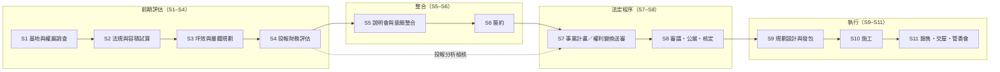

# Urban-Renewal — 都更／危老 開發評估標準化體系

> 都市更新與危老重建的**全生命週期開發流程架構**、**投報分析正典**與 **AI 多代理協作方法論**。
> 本庫為方法論主庫（知識層）；計算工具見姊妹庫 **[RE-DCF-Tool](https://github.com/jeremy0819/RE-DCF-Tool)**（容積查核 · 坪效 · 都更全案投報，Streamlit）。
> ⚠️ 全庫為通用方法論，不含任何真實案件金額與案名。非正式財務／法律意見。

---

## 架構總圖

**核心設計**：任何案件——不論大小、不論走到哪個進度——都能在 S1–S11 的座標上**定位**，並套用該階段的**產出物清單與檢核點**逐項核對。詳見 [docs/開發流程架構.md](docs/開發流程架構.md)。

---

## 標準化流程（兩層）

| 層 | 範圍 | 鐵律 |
|---|---|---|
| **坪效分析（容積查核）** | 基地 → FA → 獎勵 → 允建容積 → §162 三項免計（**逐層**）→ 計入容積／餘量 → 銷售坪 | **圖說為真的 oracle**；黃金測試鎖定 |
| **投報分析（都更全案）** | 允建／銷售坪 → 總銷 → 共同負擔六大科目 → 分回／報酬率 → 敏感度 | 只**讀**坪效輸出，**不回頭重算容積**（兩層不打架） |

投報 Excel 的標準分頁架構、資料流連動與踩坑檢核，見 [docs/投報分析架構-正確版.md](docs/投報分析架構-正確版.md)。

---

## 各 Agents 各司其職

| Agent | 職掌 | 對應階段 |
|---|---|---|
| `urban-renewal-analysis` | 案夾盤點・個案分析（唯讀，標準化八段報告） | S1、任何階段的進度定位 |
| `urban-renewal-law-assistant` | 法規研究（更新單元劃定、同意比例、容積獎勵上限、都更 vs 危老路徑） | S2、S7 |
| **RE-DCF-Tool**（evaluation analyst） | 容積查核（§162 逐層）・坪效・都更全案投報・敏感度 | S2–S4 |
| `contract-reviewer` | 合約審查（風險條款白話逐條、對地主／建商不利條款標註） | S6 |
| superpowers 工程紀律 | brainstorming → 設計核可 → spec → 實作計畫 → 驗證後交付 | 所有開發工作 |

分工原則：**法規歸法規、計算歸計算、合約歸合約**；每個 agent 的輸出是下一個 agent 的輸入，不互相越權重算。

---

## AI 協作方法論（4D）

每個分析任務依 4D 流程執行：

| 階段 | 內容 | 在都更評估的落點 |
|---|---|---|
| **1. DECONSTRUCT 拆解** | 提取核心意圖、關鍵實體、已知／缺失資訊 | 案夾盤點：基地條件、權屬、現有文件地圖、資料缺口 |
| **2. DIAGNOSE 診斷** | 檢查模糊歧義、評估完整性 | 檢核清單：顯示值≠公式真值、#REF!、三來源收斂、版本別 |
| **3. DEVELOP 構建** | 依任務類型選策略＋指定專家角色＋建立邏輯結構 | 路徑選擇（都更/危老/防災）、模式選擇（全案管理/合建/買賣）、參數建構（查證後行情） |
| **4. DELIVER 交付** | 最佳化輸出、格式對齊、使用建議 | 標準化輸出：八段報告、投報總表、敏感度、可行性結論 |

技術底座：角色設定、上下文分層、輸出規格、任務拆解；進階用 Chain-of-Thought、Few-Shot、多視角分析、約束最佳化。

---

## 文件地圖

| 文件 | 內容 |
|---|---|
| [docs/開發流程架構.md](docs/開發流程架構.md) | S1–S11 全生命週期：各階段產出物・檢核點・負責 agent |
| [docs/投報分析架構-正確版.md](docs/投報分析架構-正確版.md) | 投報 Excel 正典：分頁五群・資料流・主表四區塊・正確公式骨架・踩坑檢核 |
| [RE-DCF-Tool](https://github.com/jeremy0819/RE-DCF-Tool) | 計算工具（Streamlit）＋ Excel 對照範本 ＋ 黃金測試 |

---

*版本 1.0｜2026-06｜方法論整理自多案實務（防災都更、一般都更＋容積移轉、大基地三軌、權利變換等型態），通用化後發布。*
