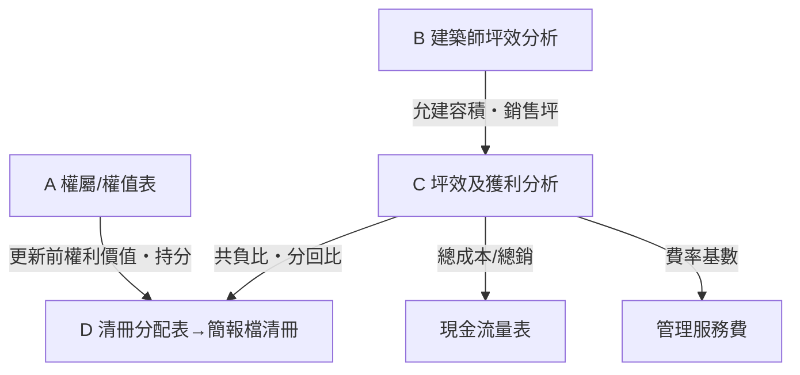

# 投報分析架構 — 正確版（正典）

> 以多案投報 Excel 實際審查為基礎（防災都更、一般都更＋容積移轉、大基地三軌〔全案管理・合建・買賣〕、權利變換送審版），逐格反推公式、比對圖說與法源後收斂出的**正確架構**。
> 審查方法：唯讀解析原檔「值＋公式」→ 以正確公式骨架重算 → 與原檔逐項比對（誤差 ≤1% 視為一致）→ 不一致處追根因（顯示值≠真值／斷鍵／簡化版本）。
> 通用方法論，不含真實案件金額。版本 1.0｜2026-06。

🔗 互動版：[🎯 開發儀表板 · 兩層引擎＋踩坑健檢](../index.html)｜流程定位：[開發流程架構](開發流程架構.md)

---

## 1. 兩層邊界（最高鐵律）

> **TL;DR**：坪效層算量體（唯一真相），投報層算錢；改容積回坪效層、改單價成本在投報層，兩層不打架。

| 層 | 職責 | 規則 |
|---|---|---|
| **坪效層（容積查核）** | FA → 獎勵 → 允建容積 → §162 免計（逐層）→ 計入容積／餘量 → 銷售坪 | 圖說為真；黃金測試鎖定 |
| **投報層（都更全案）** | 總銷 → 共同負擔 → 分回／報酬率 → 敏感度 | 只**讀**坪效輸出；不得回頭重算或覆蓋容積邏輯 |

改容積 → 回坪效層改，再讓投報引用新輸出。改單價成本 → 投報層改，不碰 §162。

---

## 2. 標準分頁架構（五群）

> **TL;DR**：權屬／權值(A)、容積引擎(B)、投報主表(C＝心臟)、分配(D)、時程／費率(E)；改任一上游沿箭頭全鏈更新。

| 群 | 分頁 | 角色 |
|---|---|:--|
| **A 權屬/權值** | 原建物及土地面積・清冊・權值表 | 更新前權屬、逐戶權值（分回基礎） |
| **B 容積引擎** | 建築師坪效分析（面積分析表） | 坪效層＝唯一量體真相 |
| **C 投報主表** | 坪效及獲利分析（全案管理／合建／買賣） | 心臟：坪效→總銷→共負→投報 |
| **D 分配** | 清冊分配表・簡報檔清冊 | 共負比 × 逐戶權值 → 各戶分配 |
| **E 時程/費率** | 開發策略・現金流量表・管理服務費 | 模式比較、分期資金、撥付階梯 |

三版主表只差**成本區塊與管理費認列**；坪效與總銷區塊必須相同。

### 資料流



**連動鐵則**：改任一上游、沿箭頭全鏈更新。最常見斷鏈＝改了 B 的容積、C 的銷售坪沒跟上。

---

## 3. 主表四區塊 — 正確公式骨架

> **TL;DR**：① 坪效分析（＝坪效層輸出）→ ② 總銷 → ③ 共同負擔六大科目（盯每筆費率的「基數」）→ ④ 投資報酬。

### ① 坪效分析（必須等於坪效層輸出）
```
基準容積 FA      ＝ 基地面積（使照）× 容積率
允建容積         ＝ FA × (1 ＋ 都更獎勵 ＋ 防災/規模獎勵 ＋ 容移率)     ← 獎勵拆項對齊法源上限
機電（免計）     ＝ 允建容積 × 15%
梯廳（免計）     ＝ (允建＋機電) ÷ 0.92～0.95 × 5～8%                 ← 逐層基準依個案核
陽台（免計）     ＝ (允建＋機電＋梯廳) × 7~10%                        ← 超出部分逐層補計入
專有面積         ＝ 允建 ＋ 陽台 − 樓層數 × 4.2（電梯井）
總銷面積         ＝ 專有 ÷ (1 − 公設比)
銷售坪           ＝ 總銷面積 × 0.3025
```
查核：銷坪比 1.58–1.68；§162 超出判斷一律**逐層（樓板×%）**，總量法（FA×%）會把超出量放大近 10 倍。

### ② 總銷分析
```
總銷 ＝ 住宅坪×住宅單價 ＋ 店舖坪×店舖單價 ＋ 車位數×車位單價
```
查核：店舖 ≈ 住宅×1.4；車位分平面/機械；平均單價回測市場評估。

### ③ 共同負擔（法定六大科目）
```
A 工程費用 ＝ 營建單價 × 總樓地板坪 ＋ 設計監造 ＋ 工程管理（基數＝營造）
B 管維費用 ＝ 工程費用 × 管維率（容獎後續管維）
C 權變費用 ＝ 權變作業（估價/規劃/鑑定，基數＝房地銷）＋ 拆遷補償(戶) ＋ 租金補償(戶×月)
D 貸款利息 ＝ 土融 ＋ 建融（基數×利率×年期×現金流係數）＋ 週轉金
E 稅捐     ＝ 營業稅（足額 5%；前期簡化版常見 1%，須標版本）＋ 印花 ＋ 增值稅
F 管理費用 ＝ 行政 ＋ 信託 ＋ 實施者（全案管理）服務費（基數＝總銷）
共同負擔   ＝ A＋B＋C＋D＋E＋F
```
查核重點＝**每筆費率的「基數」**：乘總銷／乘營造／乘工程，三者不可混。

### ④ 投資報酬
```
共同負擔比 ＝ 共同負擔 ÷ 總銷
住戶分配比 ＝ 1 − 共同負擔比
報酬率     ＝ 利潤 ÷ 總成本
```
查核：共負比＞65%（分回＜35%）→ 回頭檢視地主接受度與參數合理性。

---

## 4. 審查發現 — 錯誤 → 正確 對照表

> **TL;DR**：十大陷阱多半是「顯示值≠公式真值、基數混用、版本不一」；可用[🩺 開發儀表板 · 踩坑健檢](../index.html#health)逐項自評。

| # | 原檔常見錯誤／陷阱 | 正確處理 |
|---|---|---|
| 1 | 陽台/梯廳超出用 **FA×% 總量法** | **逐層**：各層 max(0, 實設 − 樓板×%)，再加總補計入 |
| 2 | 公設比**顯示 30%、公式實用 34%**（儲存格格式遮蔽） | 以「專有 ÷ (1−n) ＝ 總銷面積」回推驗證真值，文件標真值 |
| 3 | 費率被四捨五入隱藏（設計 0.35 顯示 0.3；代銷＝5%×折現係數顯示 10%） | 一律「小計 ÷ 基數」回推；參數表寫全精度 |
| 4 | 營業稅 1%（前期簡化）與 5%（送審足額）版本混用 | 檔名/表頭標**版本別**；送審前升級足額並重跑分回 |
| 5 | `#REF!` 斷鍵、外部活頁簿連結 `[1]…!` | 重建為自含公式；開舊檔先掃斷鍵再信數字 |
| 6 | 建融利息基數＝手填常數（規避循環參照），改總成本後忘了回填 | 基數設為**輸入格**並加註；總成本變動時人工回填或迭代兩次 |
| 7 | 營建成本誤用**銷售坪**（高估約 60%） | 營建一律用**總樓地板坪** |
| 8 | FA 用**謄本面積**（墊高免計上限、掩蓋超容） | FA 一律用**使照基地面積** |
| 9 | 獎勵率單一數字、無拆項 | 拆回 都更/防災/規模/容移，逐項對法源上限 |
| 10 | 對外簡報與內部投報**不同版** | 單一數源＋日期戳記；逐戶分配回算＝總分回、權值合計＝100% |

---

## 5. 標準審查程序（對任何一份投報 Excel）

> **TL;DR**：盤架構 → 掃斷鍵 → 反推公式 → 重算比對（≤1%）→ 真值還原 → 產出乾淨正確版。

1. **盤架構**：列分頁 → 對照五群，認出主表 C。
2. **掃斷鍵**：`#REF!`、外部連結、手填常數。
3. **反推公式**：主表四區塊逐格「值＋公式」傾印，建立計算鏈。
4. **重算比對**：以本檔公式骨架重算 → 與原檔逐項比（≤1% 一致）。
5. **真值還原**：顯示值≠公式值處，以回推法還原並記錄（§4 對照表）。
6. **產出正確版**：乾淨重算檔（輸入黃底／全公式自含／附「原檔值-差異-一致?」對照欄）＋ 審查紀錄。

對應工具：[RE-DCF-Tool](https://github.com/jeremy0819/RE-DCF-Tool)（`calc_容積查核` L2–L4・`calc_投報全案` L6・`都更全案投報_對照範本.xlsx`）。

---

## 名詞速查

| 名詞 | 速解 |
|---|---|
| **oracle（圖說為真）** | 坪效層以建築師圖說／面積表為唯一真值來源；投報層引用、不覆寫。 |
| **§162 逐層 vs 總量法** | 免計超出量須逐層 `max(0, 實設 − 樓板×%)` 加總；總量法 `FA×%` 會放大近 10 倍。 |
| **基數** | 每筆費率乘的對象（總銷／營造／工程）；混用是共同負擔最常見錯誤。 |
| **共同負擔比** | 共同負擔 ÷ 總銷；>65%（分回<35%）須回頭檢視地主接受度。 |
| **真值還原** | 顯示值被儲存格格式或四捨五入遮蔽時，用「小計 ÷ 基數」回推真實參數。 |
| **斷鍵** | `#REF!`、外部活頁簿連結 `[1]…!` 等失效引用；信數字前先掃除並重建為自含公式。 |
| **送審值 vs 前期簡化值** | 營業稅 5%（足額）／估價師單價等送審參數，取代前期 1%／行情假設；須標版本別。 |
| **兩層／S 階段** | 與[開發流程架構](開發流程架構.md)的 S2（容積）、S4（投報）、S7（送審共負）對應。 |

---

*免責：通用方法論，非正式財務/法律意見；共同負擔科目以《都市更新權利變換實施辦法》為據，實際以估價師核定與主管機關核定為準。*
